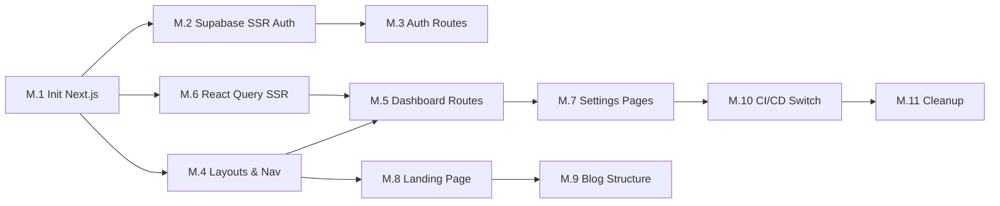

# Epic Migration: Vite to Next.js 16

**Status:** Active  
**Created:** 2025-12-30  
**Priority:** P0 (Blocking future development)  
**ADR:** [ADR-001](../implementation-artifacts/adr-001-vite-to-nextjs-migration.md)

---

## Epic Overview

Migrate the frontend application from Vite + React Router 7 to Next.js 16 App Router to enable SEO capabilities for landing/marketing pages and align with team expertise.

**Business Value:**

- SEO visibility for marketing launch
- Reduced team learning curve (Next.js familiarity)
- Server-side rendering for improved performance
- Unified tech stack for long-term maintainability

**FRs Covered:** SEO (new), Authentication (FR1), all existing FRs preserved
**NFRs Covered:** NFR1 (Performance), NFR6 (Accessibility)

---

## Stories

### Story M.1: Initialize Next.js 16 with Turborepo Integration

As a Developer,  
I want a Next.js 16 application properly integrated into the monorepo,  
So that I can begin migrating routes and components.

**Acceptance Criteria:**

**Given** the existing Turborepo + pnpm workspace  
**When** I initialize Next.js 16 in `apps/web`  
**Then** the project should be created with App Router enabled  
**And** TypeScript strict mode should be configured  
**And** Tailwind CSS 4 should be configured  
**And** existing shared packages (`@repo/ui`, `@repo/api-types`, `@repo/database-types`) should be importable  
**And** `pnpm dev --filter web` should start the dev server on a different port (3001)  
**And** the following structure should be established:

```
apps/web/
├── app/              # App Router
│   ├── layout.tsx    # Root layout
│   ├── page.tsx      # Landing page (SSG)
│   └── (auth)/       # Auth route group
├── components/       # Migrated components
├── lib/              # Utilities (migrate from @/)
├── next.config.ts    # Next.js configuration
├── tailwind.config.ts
└── package.json
```

**Story Points:** 3

---

### Story M.2: Supabase SSR Authentication Setup

As a User,  
I want to authenticate securely with server-side session handling,  
So that my session is more secure than client-only JWT storage.

**Acceptance Criteria:**

**Given** the Next.js 16 app  
**When** I configure Supabase SSR authentication  
**Then** `@supabase/ssr` package should be installed and configured  
**And** middleware should handle session refresh on every request  
**And** server components should access session via `createServerClient`  
**And** client components should access session via `createBrowserClient`  
**And** httpOnly cookies should be used instead of localStorage  
**And** OAuth callback (`/auth/callback`) should work correctly  
**And** protected routes should redirect to login when unauthenticated.

**Implementation Notes:**

```typescript
// middleware.ts
import { createServerClient } from "@supabase/ssr";
import { NextResponse } from "next/server";

export async function middleware(request: NextRequest) {
  const supabase = createServerClient(/* ... */);
  const {
    data: { session },
  } = await supabase.auth.getSession();

  if (!session && request.nextUrl.pathname.startsWith("/dashboard")) {
    return NextResponse.redirect(new URL("/login", request.url));
  }
  return NextResponse.next();
}
```

**Story Points:** 8 (High risk - auth is critical)

---

### Story M.3: Migrate Auth Routes (Login/Signup/OAuth)

As a User,  
I want to log in and sign up using the new Next.js app,  
So that I can access my portfolio dashboard.

**Acceptance Criteria:**

**Given** the existing auth UI components  
**When** I migrate auth routes to Next.js  
**Then** `/login` should render the login form with Google OAuth and email options  
**And** `/signup` should render the signup form  
**And** `/auth/callback` should handle OAuth redirects  
**And** `/auth/confirm` should handle email confirmation  
**And** `/forgot-password` and `/update-password` should work  
**And** form validation and error handling should be preserved  
**And** UI should match existing design (Radix, Tailwind, Framer Motion).

**Migrated Routes:**

- `_auth.login.tsx` → `app/(auth)/login/page.tsx`
- `_auth.sign-up.tsx` → `app/(auth)/signup/page.tsx`
- `_auth.oauth.tsx` → `app/(auth)/callback/route.ts`
- `_auth.forgot-password.tsx` → `app/(auth)/forgot-password/page.tsx`
- `_auth.update-password.tsx` → `app/(auth)/update-password/page.tsx`

**Story Points:** 5

---

### Story M.4: Migrate Layout Components & Navigation

As a User,  
I want the familiar dashboard layout and navigation in the new app,  
So that I have a consistent experience.

**Acceptance Criteria:**

**Given** the existing protected layout (`_protected._layout.tsx`)  
**When** I migrate layouts to Next.js  
**Then** `app/(protected)/layout.tsx` should wrap authenticated routes  
**And** the sidebar navigation should be migrated and functional  
**And** the theme provider (next-themes) should work  
**And** Framer Motion animations should be preserved  
**And** mobile responsive behavior should be maintained.

**Layout Structure:**

```
app/
├── layout.tsx              # Root (providers, fonts)
├── (marketing)/            # Public pages (SSG)
│   ├── layout.tsx
│   └── page.tsx            # Landing page
├── (auth)/                 # Auth routes
│   └── layout.tsx
└── (protected)/            # Authenticated routes
    ├── layout.tsx          # Sidebar + header
    ├── dashboard/
    └── portfolio/
```

**Story Points:** 5

---

### Story M.5: Migrate Dashboard & Portfolio Routes

As a User,  
I want to see my portfolios and dashboard in the new app,  
So that I can manage my investments.

**Acceptance Criteria:**

**Given** the existing dashboard routes  
**When** I migrate to Next.js  
**Then** `/dashboard` should display portfolio list  
**And** `/portfolio/[id]` should display portfolio detail  
**And** `/portfolio/[id]/asset/[symbol]` should display asset detail  
**And** React Query hooks should work with SSR hydration  
**And** all existing functionality should be preserved  
**And** URL structure should match existing routes.

**Route Migrations:**

- `_protected._layout.dashboard.tsx` → `app/(protected)/dashboard/page.tsx`
- `_protected._layout.portfolio.$id._index.tsx` → `app/(protected)/portfolio/[id]/page.tsx`
- `_protected._layout.portfolio.$id.asset.$symbol.tsx` → `app/(protected)/portfolio/[id]/asset/[symbol]/page.tsx`

**Story Points:** 8

---

### Story M.6: React Query SSR Hydration Setup

As a Developer,  
I want React Query to work seamlessly with Next.js SSR,  
So that data is pre-fetched on the server and hydrated on the client.

**Acceptance Criteria:**

**Given** the existing React Query hooks  
**When** I configure SSR hydration  
**Then** `QueryClientProvider` should wrap the app in `app/providers.tsx`  
**And** `HydrationBoundary` should be used for server-fetched data  
**And** existing hooks (`use-portfolios`, `use-transactions`, etc.) should work  
**And** cache should be properly dehydrated/rehydrated  
**And** no flash of loading state for cached data.

**Implementation Pattern:**

```typescript
// app/providers.tsx
'use client'
import { QueryClient, QueryClientProvider } from '@tanstack/react-query'

export function Providers({ children }) {
  const [queryClient] = useState(() => new QueryClient())
  return (
    <QueryClientProvider client={queryClient}>
      {children}
    </QueryClientProvider>
  )
}
```

**Story Points:** 3

---

### Story M.7: Migrate Settings & Connections Pages

As a User,  
I want to access settings and connection management in the new app,  
So that I can configure my preferences.

**Acceptance Criteria:**

**Given** the existing settings routes  
**When** I migrate to Next.js  
**Then** `/settings` should display user preferences  
**And** `/settings/connections` should display exchange connections  
**And** form state and validation should work  
**And** API mutations should save correctly.

**Route Migrations:**

- `_protected._layout.settings.tsx` → `app/(protected)/settings/page.tsx`
- `_protected.settings.connections.tsx` → `app/(protected)/settings/connections/page.tsx`

**Story Points:** 3

---

### Story M.8: Create SEO Landing Page

As a Visitor,  
I want to see a compelling landing page that explains fin-sight,  
So that I understand the value proposition before signing up.

**Acceptance Criteria:**

**Given** the marketing scope (landing page + blog)  
**When** I create the landing page  
**Then** `/` should render a static (SSG) landing page  
**And** it should include: Hero section, Features, Testimonials, CTA  
**And** SEO meta tags should be properly configured (title, description, og:image)  
**And** page should score 90+ on Lighthouse Performance  
**And** design should match the premium aesthetic of the dashboard.

**SEO Configuration:**

```typescript
// app/page.tsx
export const metadata: Metadata = {
  title: "fin-sight | Multi-Asset Portfolio Intelligence",
  description:
    "Track VN stocks, US equities, and crypto in one calm dashboard.",
  openGraph: {
    title: "fin-sight",
    description: "...",
    images: ["/og-image.png"],
  },
};
```

**Story Points:** 5

---

### Story M.9: Blog/Marketing Content Structure

As a Content Creator,  
I want a blog structure for marketing content,  
So that we can publish SEO-optimized articles.

**Acceptance Criteria:**

**Given** the marketing content needs  
**When** I create the blog structure  
**Then** `/blog` should list blog posts  
**And** `/blog/[slug]` should display individual posts  
**And** MDX should be configured for rich content  
**And** posts should be statically generated (SSG)  
**And** proper heading structure (single H1) for SEO.

**Directory Structure:**

```
app/(marketing)/
├── blog/
│   ├── page.tsx           # Blog list (SSG)
│   └── [slug]/
│       └── page.tsx       # Article (SSG)
content/
└── blog/
    ├── welcome.mdx
    └── portfolio-tracking-guide.mdx
```

**Story Points:** 5

---

### Story M.10: Deployment Switch & CI/CD Update

As a Developer,  
I want the deployment pipeline to build and deploy Next.js,  
So that the new app goes to production.

**Acceptance Criteria:**

**Given** the migrated Next.js app  
**When** I update CI/CD  
**Then** GitHub Actions should build `apps/web-next`  
**And** Docker should build Next.js production container  
**And** old Vite app should be disabled/removed  
**And** redirects should be configured if URL structure changed  
**And** health checks should verify the new deployment.

**Story Points:** 3

---

### Story M.11: Remove Vite App & Update Documentation

As a Developer,  
I want to clean up the old Vite app,  
So that we have a single frontend codebase.

**Acceptance Criteria:**

**Given** the successful Next.js migration  
**When** cutover is complete  
**Then** `apps/web` (Vite) should be deleted  
**And** `apps/web-next` should be renamed to `apps/web`  
**And** `project-context.md` should be updated for Next.js patterns  
**And** `architecture.md` should be updated with new stack  
**And** README should reflect new setup commands.

**Story Points:** 2

---

## Story Summary

| Story | Title                                | Points | Priority |
| ----- | ------------------------------------ | ------ | -------- |
| M.1   | Initialize Next.js 16 with Turborepo | 3      | P0       |
| M.2   | Supabase SSR Authentication          | 8      | P0       |
| M.3   | Migrate Auth Routes                  | 5      | P0       |
| M.4   | Migrate Layout & Navigation          | 5      | P0       |
| M.5   | Migrate Dashboard & Portfolio Routes | 8      | P0       |
| M.6   | React Query SSR Hydration            | 3      | P1       |
| M.7   | Migrate Settings & Connections       | 3      | P1       |
| M.8   | Create SEO Landing Page              | 5      | P1       |
| M.9   | Blog/Marketing Structure             | 5      | P2       |
| M.10  | Deployment Switch & CI/CD            | 3      | P0       |
| M.11  | Remove Vite & Update Docs            | 2      | P2       |

**Total:** 50 story points

---

## Dependencies



---

## Sprint Allocation

### Sprint 1 (Week 1-2): Foundation

- M.1: Initialize Next.js 16 (3 pts)
- M.2: Supabase SSR Auth (8 pts)
- M.3: Migrate Auth Routes (5 pts)
- M.4: Migrate Layouts & Nav (5 pts)

**Sprint 1 Total:** 21 points

### Sprint 2 (Week 3-4): Core Features

- M.5: Dashboard & Portfolio Routes (8 pts)
- M.6: React Query SSR (3 pts)
- M.7: Settings & Connections (3 pts)
- M.8: SEO Landing Page (5 pts)

**Sprint 2 Total:** 19 points

### Sprint 3 (Week 5): Cutover

- M.9: Blog Structure (5 pts)
- M.10: CI/CD Switch (3 pts)
- M.11: Cleanup & Docs (2 pts)

**Sprint 3 Total:** 10 points
