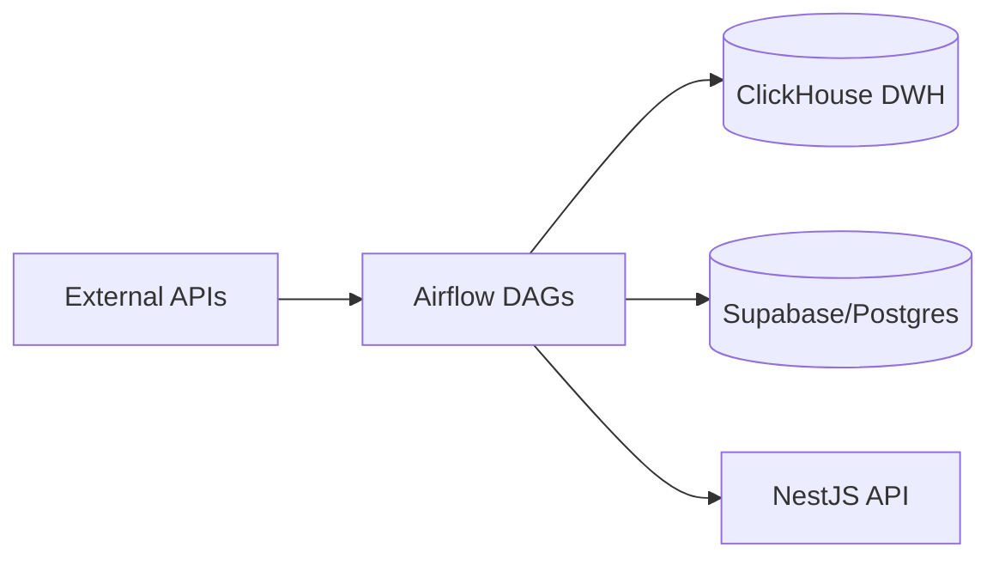

# Portfolios Tracker: Data Pipeline

The **Data Pipeline** service is the institutional-grade ETL engine of the Portfolios Tracker platform. Built with **Apache Airflow**, it handles automated data ingestion, normalization, and warehousing for multi-asset intelligence.

## 🏗️ Architecture

The pipeline follows a modular ETL/ELT architecture:

- **Orchestrator**: Apache Airflow 3.x (CeleryExecutor)
- **Data Warehouse**: ClickHouse (for historical market data and analytics)
- **Message Broker**: Redis
- **Metadata DB**: PostgreSQL
- **Key Providers**: vnstock, yfinance, CoinGecko, Supabase

### Data Flow



## 📂 Core Components

- `dags/`: Airflow directed acyclic graphs for all workflows.
- `dags/etl_modules/`: Shared logic for data fetching and notifications.
- `scripts/`: Initialization and utility scripts.
- `sql/`: DDL scripts for ClickHouse schema management.

## 🚀 Key Workflows (DAGs)

| DAG Name                    | Schedule           | Description                                                         |
| :-------------------------- | :----------------- | :------------------------------------------------------------------ |
| `assets_dimension_etl`      | Weekly             | Syncs asset master data (VN/US Stocks, Crypto) to ClickHouse.       |
| `market_data_evening_batch` | Mon-Fri (6 PM ICT) | Fetches end-of-day prices, ratios, and fundamentals.                |
| `market_news_morning`       | Mon-Fri (7 AM ICT) | Aggregates daily news and sends summaries to Telegram.              |
| `portfolio_daily_snapshot`  | Daily              | Triggers portfolio performance snapshots via NestJS API.            |
| `sync_assets_to_postgres`   | On Demand          | Syncs ClickHouse asset dimensions back to the application database. |

## 🛠️ Local Development

### Prerequisites

- Docker & Docker Compose
- `uv` (recommended for local Python environment)

### Setup

1. **Initialize Environment**:
   ```bash
   cp template.env .env
   ```
2. **Start Cluster**:
   ```bash
   docker compose up -d
   ```
3. **Access UI**:
   - Airflow Webserver: [http://localhost:8080](http://localhost:8080) (default: `airflow`/`airflow`)
   - Flower (Celery Monitor): [http://localhost:5555](http://localhost:5555)

### Running Tests

```bash
./run_tests.sh
```

## ⚙️ Configuration

Key environment variables in `.env`:

- `TELEGRAM_BOT_TOKEN` / `TELEGRAM_CHAT_ID`: For alert notifications.
- `GEMINI_API_KEY`: For AI-powered news summarization.
- `DATA_PIPELINE_API_KEY`: Internal authentication for NestJS API calls.
- `SUPABASE_URL` / `SUPABASE_SERVICE_ROLE_KEY`: Application database access.
